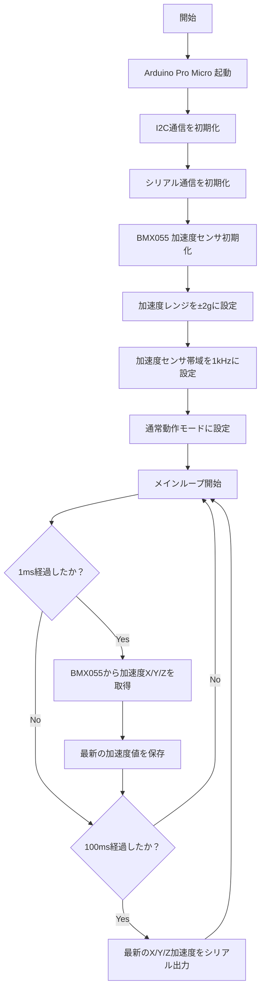

# BMX055 加速度取得プログラム for Arduino Pro Micro

## 概要

このプログラムは、秋月電子通商の **BMX055使用9軸センサーモジュール** を Arduino Pro Micro で使用し、加速度センサの **X軸・Y軸・Z軸の加速度のみ** を取得・表示するためのサンプルプログラムです。

BMX055は加速度・ジャイロ・地磁気を取得できる9軸センサですが、本プログラムでは **加速度センサのみ** を使用します。

加速度データはマイコン内部で **1kHz周期** で取得し、Arduino IDEのシリアルモニタには目視確認しやすいように **10Hz周期** で表示します。

## 主な仕様

| 項目 | 内容 |
|---|---|
| 使用マイコン | Arduino Pro Micro |
| 使用センサ | BMX055使用9軸センサーモジュール |
| 通信方式 | I2C |
| 取得データ | X軸・Y軸・Z軸の加速度 |
| 加速度取得周期 | 1kHz |
| シリアル表示周期 | 10Hz |
| 加速度レンジ | ±2g |
| シリアル通信速度 | 115200bps以上推奨 |

## 使用機器

| 機器 | 備考 |
|---|---|
| Arduino Pro Micro | 5V 16MHz版 |
| BMX055使用9軸センサーモジュール | 廃盤 |
| Arduino IDE | ここにバージョンを記載 |

https://akizukidenshi.com/catalog/g/g113010/

JP4, 5, 6をショート（I2Cプルアップ有効、電源・信号レベル5V）

## 配線

| BMX055モジュール | Arduino Pro Micro |
|---|---|
| VCC | VCC |
| GND | GND |
| SDA | D2 / SDA |
| SCL | D3 / SCL |

## 動作内容

1. Arduino Pro Microを起動する
2. I2C通信を初期化する
3. BMX055の加速度センサを初期化する
4. 加速度レンジを±2gに設定する
5. 加速度センサの帯域を1kHzに設定する
6. 1msごとに加速度X/Y/Zを取得する
7. 100msごとに最新の加速度値をシリアルモニタへ表示する

## シリアル出力形式

シリアルモニタには、以下の形式で加速度が表示されます。

各値の単位は g です。

```text
X[g],Y[g],Z[g]
0.0123,-0.0045,0.9987
0.0121,-0.0047,0.9985
0.0124,-0.0046,0.9986
```

## フローチャート



## 注意事項

* 本プログラムでは、BMX055のうち加速度センサのみを使用します。
* ジャイロセンサ、地磁気センサの値は取得しません。
* マイコン内部では1kHzで加速度を取得しますが、シリアル出力は10Hzに間引いています。
* Arduino IDEのシリアルモニタで確認する場合は、表示速度に余裕を持たせるため 115200bps以上 を推奨します。
* より安定して確認したい場合は、1000000bps に設定してください。