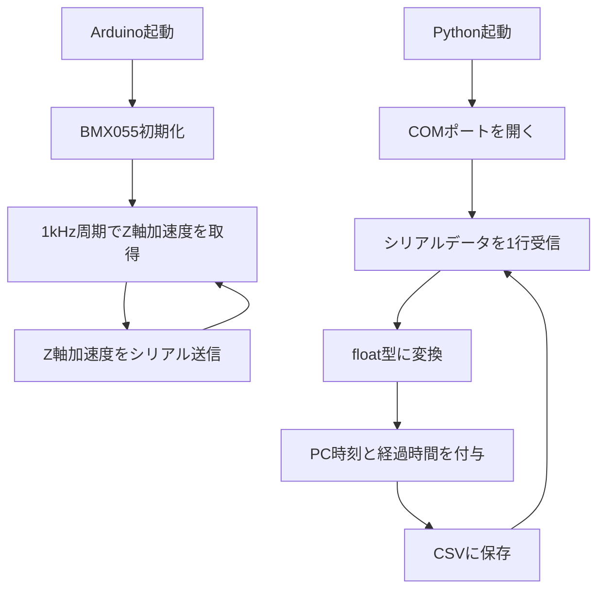

# BMX055 Z軸加速度ロガー for Gaming Typewriter

## 概要

このプログラムは、**AE-BMX055 9軸センサーモジュール**を使用して、タイプライターのスライド部分に取り付けた加速度センサから **Z軸加速度のみ**を取得し、PC側でCSVファイルに保存するためのものです。

タイプライターのキー押下時に発生する機械的な衝撃をZ軸加速度として記録し、後続処理でキー押下検出条件を決定することを目的としています。

Arduino側では、BMX055からZ軸加速度を約1kHz周期で取得し、シリアル通信でPCへ送信します。  
PC側では、Pythonでシリアルデータを受信し、タイムスタンプ付きでCSVファイルに保存します。

---

## システム構成

```text
Arduino Pro Micro →（I2C）AE-BMX055 9軸センサーモジュール
  ↓ USB Serial
PC
  ↓ Python
CSVファイル保存
```

AE-BMX055はタイプライターのキャリッジに設置する（動作方向にZ軸が向くようにする）

---

## 使用機器

| 項目 | 内容 |
|---|---|
| マイコン | Arduino Pro Micro |
| センサ | AE-BMX055 9軸センサーモジュール |
| 使用センサ機能 | 加速度センサのみ |
| 使用軸 | Z軸のみ |
| 通信方式 | I2C |
| PCとの通信 | USBシリアル |
| ボーレート | 1,000,000 bps |

---

## Arduino側仕様

| 項目 | 内容 |
|---|---|
| 取得軸 | Z軸加速度のみ |
| 取得周期 | 1kHz |
| 送信周期 | 1kHz |
| 送信形式 | Z軸加速度 `[g]` の数値のみ |
| 加速度レンジ | ±2g |
| BMX055 I2Cアドレス | `0x19` |

Arduinoからは、以下のようにZ軸加速度だけを1行ずつ送信します。

```text
0.0020
0.0039
-0.0010
0.9876
```

CSV保存しやすくするため、ラベルやカンマは付けず、1行に1データのみ送信します。

---

## Python側仕様

Python側では、Arduinoから送信されたZ軸加速度を受信し、以下の形式でCSVに保存します。

| 列名 | 内容 |
|---|---|
| `timestamp_iso` | PCで受信した日時 |
| `elapsed_sec` | Pythonプログラム開始後の経過時間 `[s]` |
| `z_g` | Z軸加速度 `[g]` |

CSV出力例：

```csv
timestamp_iso,elapsed_sec,z_g
2026-05-04T22:03:56.123,0.001234,0.0020
2026-05-04T22:03:56.124,0.002231,0.0039
2026-05-04T22:03:56.125,0.003228,-0.0010
```

---

## 処理フロー



---

## 調査結果

### 1kHzで受信できているか

取得したCSVを確認した結果、記録内容は以下の通りでした。

| 項目 | 結果 |
|---|---:|
| データ数 | 32834行 |
| 記録時間 | 約27.03秒 |
| 平均行数 | 約1214.7行/秒 |
| 受信間隔の中央値 | 約0.92ms |
| 0.5ms未満の受信間隔 | 7538件 |
| 0.5〜1.5msの受信間隔 | 25099件 |
| 1.5ms超えの受信間隔 | 196件 |

平均行数が1kHzを超えているため、CSV上の `elapsed_sec` だけを見ると、厳密な1kHz周期には見えません。

これは、Python側のタイムスタンプが **Arduinoでセンサを取得した時刻**ではなく、**PCがシリアルバッファから読み出した時刻**であるためです。

PC側では、USBシリアルやOSの処理により、バッファに溜まったデータをまとめて読み出すことがあります。

そのため、このCSVだけでは、

```text
Arduino内部で本当に1msごとに取得できているか
```

を厳密に確認することはできません。

ただし、Arduino側のプログラムでは `micros()` を使って1ms周期でZ軸取得と送信を行う構造になっており、取得データ数も十分多いため、実用上はおおむね1kHz相当で記録できていると考えられます。

---

### 平常時のZ軸加速度

キーを押下していない平常時のZ軸加速度は、ほぼ0g付近で安定していました。

| 項目 | 結果 |
|---|---:|
| 平常時の中央値 | 約0.002g |
| 平常時の標準偏差 | 約0.0059g |
| 平常時の99.9%範囲 | 約±0.02g以内 |

この結果から、平常時のノイズは非常に小さく、キー押下時の衝撃とは明確に区別できることが分かりました。

---

### キー押下時のZ軸加速度

キー押下時には、Z軸加速度に明確なスパイクが発生しました。

特に、押下時には以下のような値が確認されました。

```text
Z軸加速度: 最大 約 +2.0061g
```

現在のBMX055設定は±2gレンジであるため、押下時の波形がセンサ上限付近に張り付いている可能性があります。

つまり、実際の加速度は2gを超えている可能性があります。

---

## 押下検出条件の検討

今回のデータでは、平常時ノイズが約±0.02g以内である一方、キー押下時には0.5gを大きく超えるスパイクが発生していました。

そのため、キー押下検出条件としては、以下が有効と考えられます。

```text
|Z - baseline| > 0.5g
```

ここで、`baseline` はキーを押していない状態のZ軸基準値です。

今回のデータでは、平常時の中央値が約0.002gであったため、概ね0g基準として扱えます。

---

## 推奨しきい値

| 目的 | 条件 |
|---|---|
| 標準設定 | `|Z - baseline| > 0.5g` |
| 誤検出を減らしたい場合 | `|Z - baseline| > 0.8g` |
| 軽い押下も拾いたい場合 | `|Z - baseline| > 0.25g` |

現時点では、以下の条件が最もバランスが良いと考えられます。

```text
|Z - baseline| > 0.5g
```

さらに、キー押下後の振動による連続検出を防ぐため、押下検出後は一定時間、再検出を無視する必要があります。

```text
押下検出後 300ms は再検出を無視する
```

---

## 今後の押下検出プログラムへの反映

今回の解析結果から、タイプライターのキー押下検出には以下の条件を使用する予定です。

```text
押下検出条件:
  |Z - baseline| > 0.5g

再検出防止:
  押下検出後 300ms は無視

シリアル送信:
  押下検出時のみ "1" を送信
```

この条件により、キー押下時の大きな衝撃のみを検出し、押下後の振動による複数回検出を防ぐことができます。

---

## 注意点

### Python側のタイムスタンプについて

CSVに保存される `timestamp_iso` と `elapsed_sec` は、PC側で受信した時刻です。

そのため、以下の用途には使えます。

```text
記録開始から何秒後に大きな加速度が発生したか
押下イベントのおおまかなタイミング確認
波形解析
```

一方で、以下の用途には注意が必要です。

```text
センサ取得周期そのものの厳密な確認
サンプル間隔の厳密な測定
```

厳密なサンプリング周期を確認したい場合は、Arduino側で取得時刻を記録し、シリアル送信する必要があります。

---

### ±2gレンジについて

現在の設定では、BMX055の加速度レンジを±2gにしています。

キー押下時に+2g付近まで到達しているため、波形が上限で潰れている可能性があります。

単にキー押下を検出するだけであれば、±2gレンジでも問題ありません。

しかし、今後、以下のような解析を行う場合は注意が必要です。

```text
キーごとの加速度波形の違いを比較する
押下の強さを推定する
機械学習でキー種別を分類する
```

このような用途では、加速度レンジを±4gまたは±8gに変更した方が、波形の違いを取りやすくなる可能性があります。

---

## まとめ

このプログラムにより、タイプライターのスライド部分に取り付けたBMX055から、Z軸加速度を約1kHzで取得し、PC側でCSV保存できます。

今回の測定結果から、キー押下時には平常時ノイズに対して十分大きな加速度スパイクが発生することが分かりました。

そのため、キー押下検出には以下の条件が有効です。

```text
|Z - baseline| > 0.5g
```

また、押下後の振動による連続検出を防ぐため、以下の処理を追加するのが適切です。

```text
押下検出後 300ms は再検出を無視する
```

この条件を用いることで、タイプライターのキー押下をシンプルに検出できる見込みです。